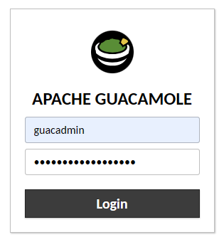
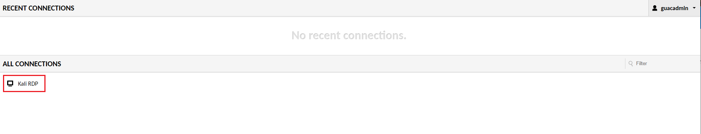
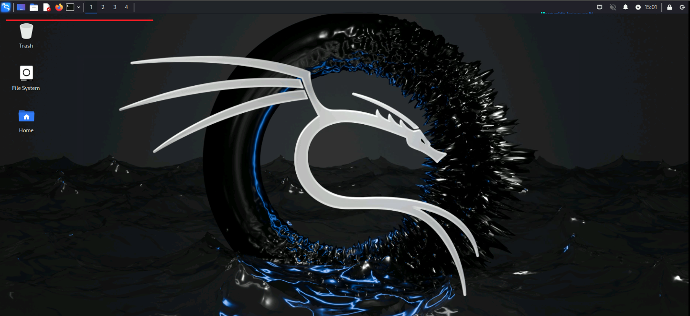

### ***Logging into your student environment***

## Prereqs
  - Internet Access
  - Web Browser
    - Any modern browser will work.  Your student environment includes a client and server with all required software.


### Start Kali RDP

For this lab, we will only need to interact with the Kali linux device.  We will use guacamole to create an RDP session in your browser.

- In your browswer window, typ in the url below, substituting your Kali server IP.

```
https://<kali-IP>
```
- Accept all warnings and proceed to the site.
- You will be prompted to login to Apache Guacamole.  
  - Type **guacadmin** for both Username and password and then click **Login**



- The Guacamole home page will have a list of connections.  Click on the connection labled **Kali RDP**



- Note the icons at the top left of the screen.  We will be using these during the lab.




