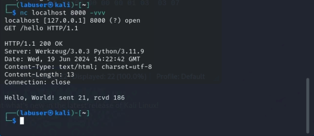
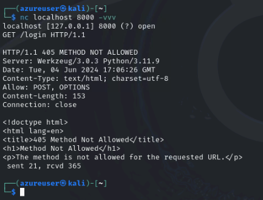

**According to the "manpage":** netcat is  a simple unix utility which reads and writes data across network connections, using TCP or UDP protocol. It is designed to be a reliable "back-end" tool  that  can  be used  directly or easily driven by other programs and scripts.  At the same time, it is a feature-rich network debugging and exploration tool, since it can create almost any  kind of  connection you would need and has several interesting built-in capabilities.  Netcat, or "nc" as the actual program is named, should have been supplied long ago as another one of those cryptic but standard Unix tools.

We will be using cetcat to craft http calls to our flask application.  These will all be made against "localhost", but it could just as easily use a public URL.

## Make your first call

{} When making the below calls, you will not want to try and paste them in all at once.  Please enter the commands **one line at a time**. {}

```
nc localhost 8000 -vvv
GET /hello HTTP/1.1
<hit enter again>
```

- You should see some response headers returned as well as the programmed response from the app. We can see the **200 OK** status, meaning that our application is actually working and we called a valid resource.
<details>
<summary><h5><b>Click here for example</b></h5></summary>
  
  

</details>

{}
We also get some other useful information about the application, including the Application server software as well as the python version used.  Generally speaking the less information potential attackers have about your application, the better.  If this information is exposed, it is imperitive to ensure that servers are appropriately patched.
{}

## Method Not Allowed

- In our first call above, we used the **GET** method against http://localhost:8000/hello.  Let's try the same thing against a different URL

```
nc localhost 8000 -vvv
GET /login  HTTP/1.1
<hit enter again>
```
<details>
  <summary><h5><b>Click here for example</b></h5></summary>
   
   

</details>

- As you can see, we got the **Method Not Allowed (405)** error. In the example output, you can see that we only allow **POST** and **OTIONS** methods.

## Form Data

The FormData interface provides a way to construct a set of key/value pairs representing form fields and their values.
