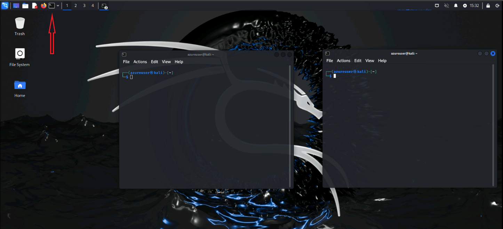
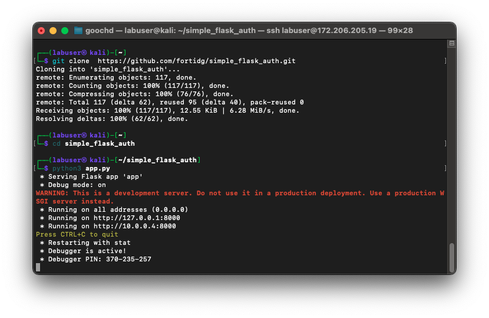

|                            |    |  
|----------------------------| ----
| **Goal**                   | Start application
| **Task**                   | Clone github repository and deploy application
| **Verify task completion** | You should see the repo

**According to Google AI:** Flask is a web development framework written in Python that helps developers build web applications. It's a microframework, which means it doesn't rely on specific tools or libraries, and it's considered a good choice for developers who are already familiar with Python. Flask's minimalistic design gives developers more control over their applications' structure, and it includes features like templating, database integration, and routing.

More information about Flask can be found at the [Flask documentation page](https://flask.palletsprojects.com/en/3.0.x/)


## Navigate to the Kali Linux CLI
For this exercise, we will be using a very simple flask application.  Students will start the application within a python virtual environment. It is useful to monitor the debug messages for the application during user interactions. 

- We will be opening two CLI connections to Kali.  If you have the ability to ssh from your laptop, you can open two sessions:

    ```
    ssh labuser@<kali-ip>
    
    password: S3cur3P4ssw0rd123!
    ```

- If you prefer, you can open two terminal windows from the Kali Desktop

    


### Start Flask Application

- Choose one of the terminal sessions that you opened and issue the below commands:

    ```
    git clone  https://github.com/fortidg/simple_flask_auth.git
    cd simple_flask_auth
    python3 app.py
    ```
- You should see that the flask application has successfully started and is listening on port 8000.
- Leave this terminal window open so the app continues to run

    
    
    {} If you would like to take a look at the Flask Application itself, you can use 
    ```cat simple_flask_auth/app.py``` or navigate to this [Github Repo.](https://github.com/fortidg/simple_flask_auth) {}
