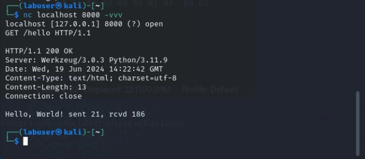
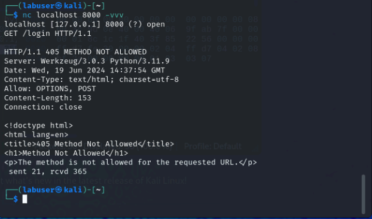

|                            |    |  
|----------------------------| ----
| **Goal**                   | Learn how to use netcat to craft http requests
| **Task**                   | Use netcat to interact with our simple appliction by using form data and json.  We will monitor network behavior using Wireshark.
| **Verify task completion** | If entered properly, the flask application will return data, as hightlighted below

**According to the "manpage":** netcat is  a simple unix utility which reads and writes data across network connections, using TCP or UDP protocol. It is designed to be a reliable "back-end" tool  that  can  be used  directly or easily driven by other programs and scripts.  At the same time, it is a feature-rich network debugging and exploration tool, since it can create almost any  kind of  connection you would need and has several interesting built-in capabilities.  Netcat, or "nc" as the actual program is named, should have been supplied long ago as another one of those cryptic but standard Unix tools.

We will be using Netcat to craft a series of HTTP calls to our flask application and observing the resulting actions.  We are using "localhost" as our destination because we are executing NC from the same Kali Linux instance that's hosting the Flask Web App, but it could just as easily use a public URL.

## Make your first web call
For this first example, we want to use Wireshark to watch the interaction between netcat and the Flask web server.

- In wireshark, select **Loopback:lo** as the interface and enter ```host 127.0.0.1 and port 8000``` into the capture filter


{} 

Please take care when entering the commands below. Please enter the commands **one line at a time**, and be sure to hit enter twice after each web command. 

  For Example:
  
  1. Open the TCP 3-way handshake and wait for the return
    
  ```
  nc localhost 8000 -vvv
  ```

  2. Enter the HTTP request

  ```
  GET /hello HTTP/1.1
  ``` 

  3. _**Hit enter 2 times**_
  
{}


- From the 2nd ssh session terminal to Kali Linux, let's start the tcp connection

```
nc localhost 8000 -vvv
```

- The resulting Wirshark capture should show us the TCP three-way handshake


- Now let's finish the call by adding L7 comonents 

```
GET /hello HTTP/1.1
<hit enter again>
```

- You should see some response headers returned as well as the programmed response from the app. We can see the **200 OK** status, meaning that our application is actually working and we requested a valid resource.

  


- Now we can look back at Wireshark and see the rest of the traffic associated with this call.


{} We can see the underlying HTTP in this Wireshark capture because we are not using Secure HTTP (TLS or Quic) If this traffic were encrypted using TLS, we would only see TCP and TLS {}

{}
We also get some other useful information about the application, including the Application server software as well as the python version used.  Generally speaking the less information potential attackers have about your application, the better.  If this information is exposed, it is imperitive to ensure that servers are appropriately patched.
{}

- Take a look back at the terminal where you originally started the Flask application.  You should see your first debug message.


## Method Not Allowed

- In our first call above, we used the **GET** method against http://localhost:8000/hello.  Let's try the same thing against a different resource


```
nc localhost 8000 -vvv
```

```
GET /login  HTTP/1.1
<hit enter again>
```
<details>
  <summary><h5><b><li>Click here for example</b></h5></summary>
   
   

</details>

- As you can see, we got the **Method Not Allowed (405)** error. In the example output, you can see that we only allow **POST** and **OPTIONS** methods for the /login resource.

## Form Data

The FormData interface provides a way to construct a set of key/value pairs representing form fields and their values. Formdata is useful if the client does not suppor Javascript, or in a situation where it is desireable to send binary data without text encoding.  For This step, we are going to set the "Content-Type" to **x-www-form-urlencoded** and then add key/values for username and password.

```
nc localhost 8000 -vvv
```
```
POST /login HTTP/1.1
Content-Type: application/x-www-form-urlencoded
Content-Length: 34

username=student&password=welcome
```

<details>
  <summary><h5><b><li>Click here for example</b></h5></summary>
   
   

</details>


## JSON

JavaScript Object Notation (JSON) is a text-based format for representing and exchanging data that is both human and machine-readable. It is often used in web applications, but can be used independently from JavaScript and in any programming language. JSON is popular with developers because it is lightweight, easy to parse and generate, and requires less coding.  For This step, we are going to set the "Content-Type" to **json** and then add key/values for username and password in a simple JSON string.  

For more information about JSON, click on [this link](https://www.w3schools.com/js/js_json_intro.asp).

```
nc localhost 8000 -vvv
```
```
POST /save HTTP/1.1
Content-Type: application/json
Content-Length: 32

{"id": 5150, "name": "student"}

```

<details>
  <summary><h5><b><li>Click here for example</b></h5></summary>
   
   

</details>