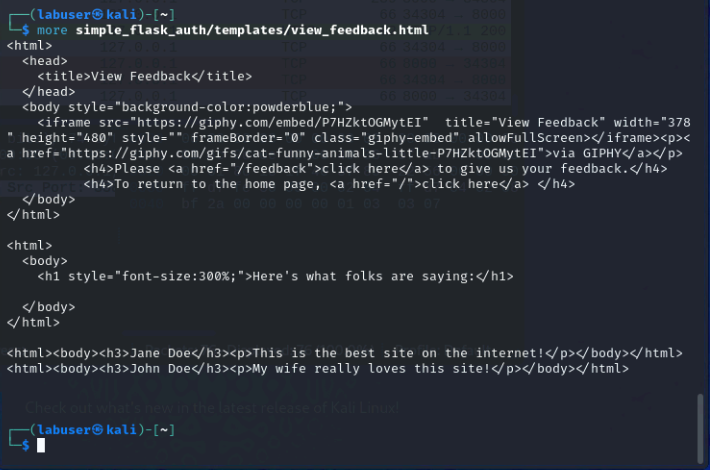

For this exercise, we will take a high level look at the Web Developer tool in Firefox.  For more information about this tool, you can go to the [Firefox DevTools User Docs](https://firefox-source-docs.mozilla.org/devtools-user/).  

Almost all browsers have developer toolkits.  Below are some notable examples:
- [Google Detools Docs](https://developer.chrome.com/docs/devtools)
- [Microsoft Edge Devtools Docs](https://learn.microsoft.com/en-us/microsoft-edge/devtools-guide-chromium/landing/)


## Open Firefox and Developer Tools


- Go to your Kali Linux RDP session
- Open Firefox from the top left menu bar and navigate to **http://localhost:8000/**
- Right click anywhere on the screen, which will cause a menu to pop up.  At the bottom of that menu, click on **Inspect(Q)**
  - This will cause "Web Developer Tools" to open at the bottom of the screen.  


## Dig a bit deeper

### Inspector

The inspector tab shows the HTML used to render this page.  Take a look at the code and expand some of the menus.

- Scroll down and **right click** on the link "To hear what other have to say".  Select **Inspect(Q)**.  This will highlight the code associated with this line.


- We can see that this is a href (hypertext reference).  this tells us the source of the file used in this tag.  
- Open your terminal and input:

```
more simple_flask_auth/templates/view_feedback.html

```

- You should see something like:



- Now, left click on the link to go to the page.  Compare the html to the the outputs on the rendered page.


### Network Inspector

The network tab gives us a lot of information about traffic to and from the appliation itself.  This can be quite useful for viewing how the application is actually operating at layer 7.

- Click on The "Network" tab in the Web Devloper Tool section at the bottom of the page.


- At a glance, we can see the HTTP status code, method and domain.
  - Notice here that much of the network traffic displayed is not from "localhost".  As we can see a lot of the traffic is from, or related to giphy.com.  This is due to the embdded link, which ultimately renders the fun Kitty GIF.
- By default, the **All** option is selected. The other options to the right, are high level category filters.
  - Select the **Images** filter.
  - In the "Filter URLs" bar, type **giphy**
  - Hover over the "File" section of one of the "media1.giphy.com" lines.


### Storage Inspector

On the left hand side of this screen is the "Storage tree", which lists all of the storage types that can be inspected.  Objects under each type are organized by origin.  In our output, we only have two origins (http://localhost:8000 and https://giphy.com)

- Expand the **Cookies** storage type.  Note that our two origins are there, but we cannot see any cookies.


- Back on the web page (http://localhost:8000/view_feedback), click the link below the GIF to give feedback.
  - Enter the Username ```student``` and Password ```Fortinet1!``` and select **Sign In**
  - Type a name and some feedback into the appropriate boxes and click **Submit**
  
- Back on the Storage tree, expand the Cookies Section and you will notice that you now have a cooked with a key/value of "name/whatever name you entered" in the "Table Widget" to the right of the Storage Tree

- Click on the new cookie.  You will notice a new "Sidebar" pop up to the right of the Table Widget.  This contains more detailed information about the cookie.


