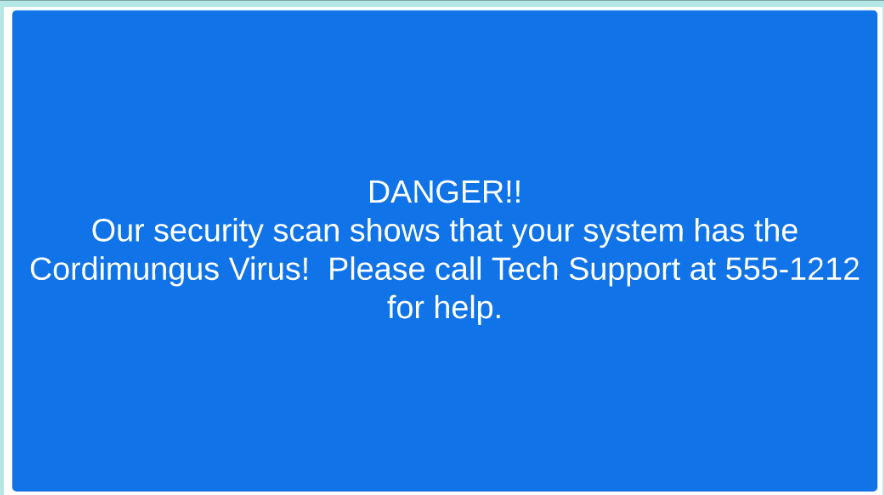

|                            |    |  
|----------------------------| ----
| **Goal**                   | Create a web defacement attack against our browser
| **Task**                   | We will use a simple cross site scripting attack to deface our web page
| **Verify task completion** | If properly executed, you will see our replacement content displayed on the feedback page


While this is not intended as an ethical hacking course, it is useful to understand how simple attacks work.  The simple flask site that we have here doesn't have any juicy databases, chock full of Personally Identifiable Information (PII) that can be harvested, but we can set a trap for a user who logs in to check the site feedback.

## Leave Feedback
- In your browser on Kali, navigate to ```http://localhost:8000/view_feedback```
  - Scroll down and read the Feedback.
- Click on the link to leave feedback and follow the process to do so.
- Navigate back to **http://localhost:8000/view_feedback** and note that your feed back was recorded.


## Deface Page

Now that we have established the fact that we can leave feedback, let's use that to perpetrate a Defacement XSS attack.
- In your browser on Kali, navigate to **http://localhost:8000/view_feedback**
- Click on the link to leave feedback and follow the process to do so.
  - For this time however, use any name in the **Name** section but copy and paste the below text into the **Feedback** section.
  - Click Submit

```
<svg onload="document.body.innerHTML=''">
```
- You should be re-directed to the Thank You Page.

- Navigate back to **http://localhost:8000/view_feedback** and note that your feed back was recorded.

<details>
<summary><h5><b><li>Click here for example</li></b></h5></summary>
  
  

</details>


