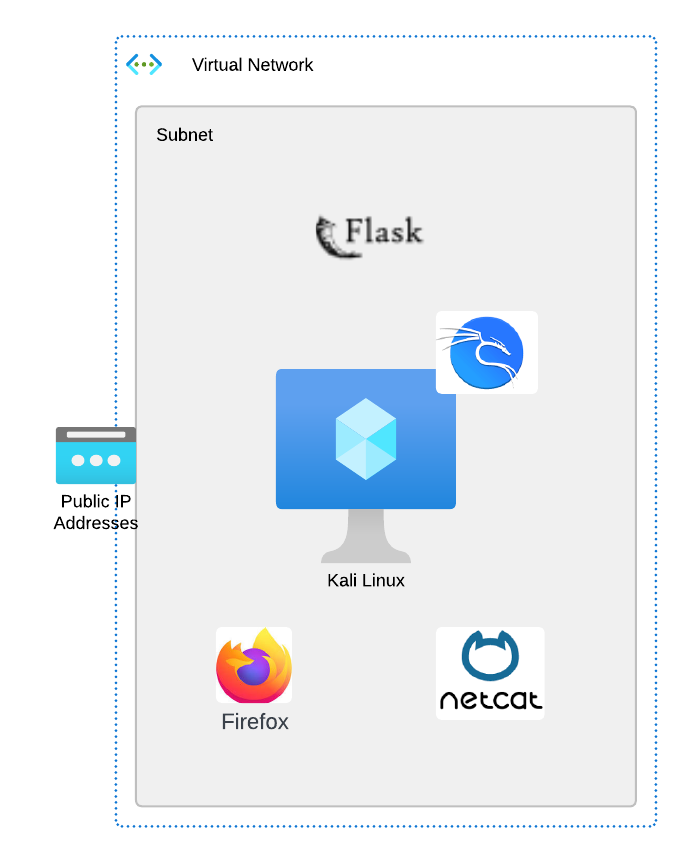

In this Module, we will explore the fundamentals of the HTTP protocol by observing network traffic sent to and from a web application using Wireshark.   All of these applications will reside on the **Kali** linux device.
- The Sample Web app is deployed on our Kali Linux instance using a freeware tool Flask.  We don't need to understand the details of developing a Flask web app
- We will use Netcat cli tool to interact with the web app, as well as explore some browser based developer tools to visualize what's going on behind the scenes.
- Finally we will execute a simple web site defacement to demonstrate how attacks can impact a web site

