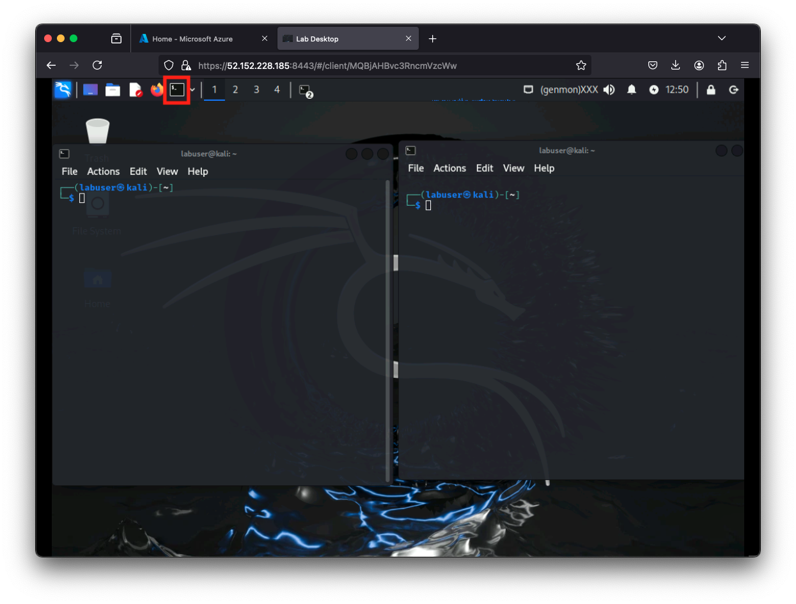
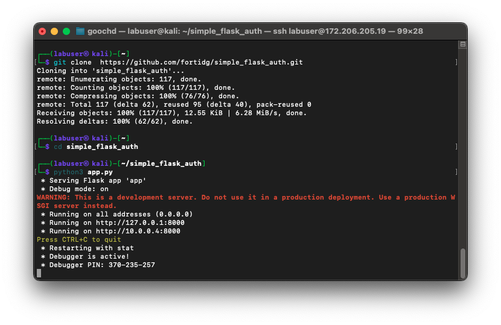

|                            |    |  
|----------------------------| ----
| **Goal**                   | Ensure flask application is running
| **Task**                   | You will clone and/or restart the app
| **Verify task completion** | If properly executed, you will see debug information about the application as pictured below


{} These are the same steps which you maybe already have done in the previous Module.
If you have the Application still running, proceed to the next task. {}

# Prepare the Environment
## Navigate to the device CLI
For this exercise, we will be using a very simple flask application.  Students will start the application within a python virtual environment. It us useful to monitor the debug messages for the application during user interactions. 

- We will be opening two CLI connections to Kali.  If you have the ability to ssh from your laptop, you can open two sessions:

```
ssh labuser@<kali-ip>

password: S3cur3P4ssw0rd123!
```

- If you prefer, you can open two terminal windows from the Kali Desktop




### Start Flask Application

- Choose one of the terminal sessions that you opened and issue the below commands:

```
git clone  https://github.com/fortidg/simple_flask_auth.git
cd simple_flask_auth
python3 app.py
```
- You should see that the flask application has successfully started and is listening on port 8000.



{} If you would like to take a look at the Flask Application itself, you can use 
```cat simple_flask_auth/app.py``` or navigate to this [Github Repo.](https://github.com/fortidg/simple_flask_auth) {}