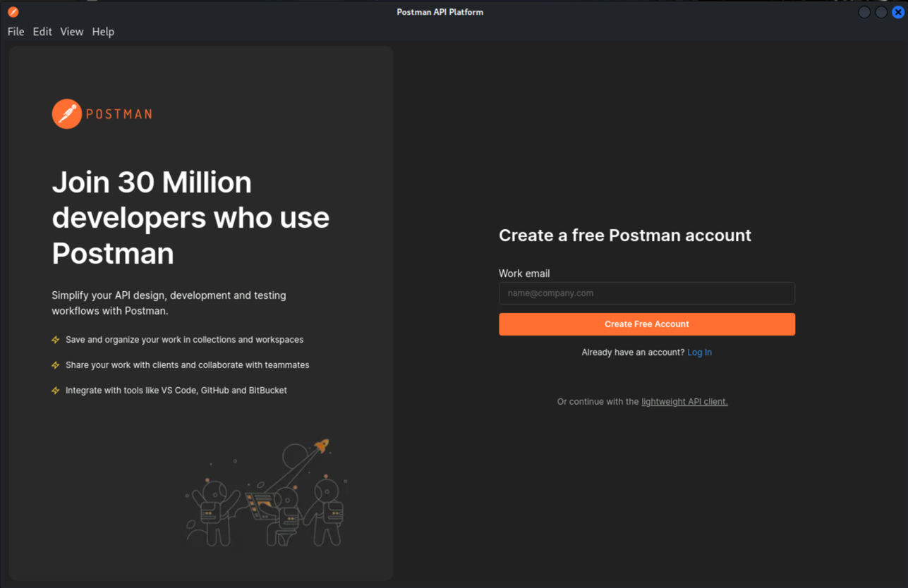
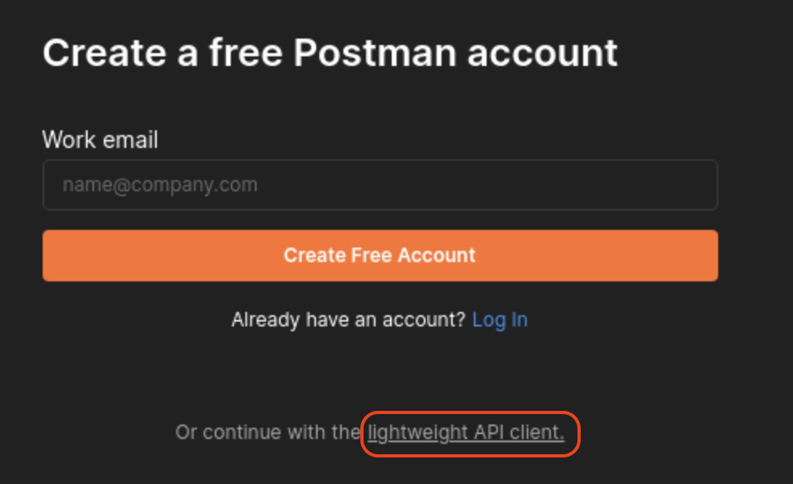
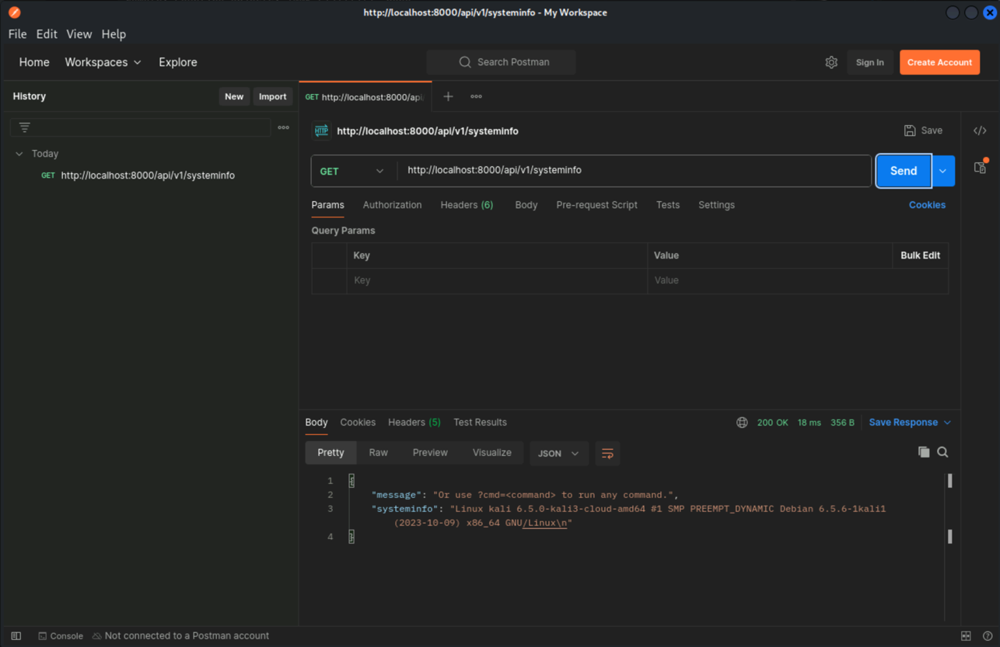
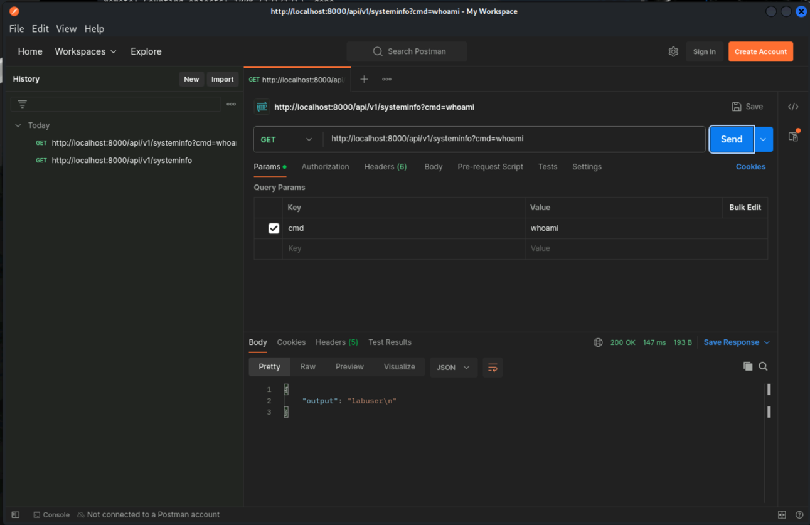
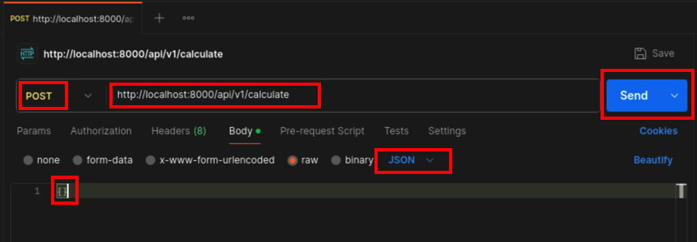
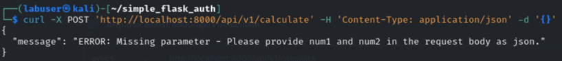

In this Task you will interact with the REST API that you have started in the previous task. You will use different tools to send requests to the API and review the output.

## Prepare the Environment
Make sure that you are still logged in to your Kali Linux Desktop environment and the Flask application is running.

## Explore the API
### Interact with REST API using **curl**

**curl** is a command line tool to transfer data using various network protocols, mostly commonly HTTP. It is available on most operating systems and can be used to interact with APIs.

2. Open a new terminal window and issue the below command:
```bash
curl -X GET 'http://localhost:8000/api/v1/systeminfo'
```
2. Review the output and try to understand the structure of the response.
3. Use the `cmd` parameter to pass a command to the API and review the output.
```bash
curl -X GET 'http://localhost:8000/api/v1/systeminfo?cmd=whoami'
```
4. Review the output and try to understand the structure of the response and what is different from the previous output.
3. Test the endpoint with different HTTP methods like **POST, PUT, DELETE** and review the output.

### Interact with REST API using Postman
Postman is a collaborative platform used for developing, testing, and documenting APIs, enabling developers to streamline and automate their API workflows.
1. To open the Postman application, type the following command in a terminal window:
```bash
Postman
```
2. A new window will open which will look like this:


3. select `lightweight API client` below the Account creation form.


4. A empty Workspace will open.
5. To create a new request, click on the `+` sign on the top left corner.
6. Enter the URL `http://localhost:8000/api/v1/systeminfo` and select the HTTP method **GET**.
7. Click on **Send** and review the output.

8. Repeat the above steps by passing the **?cmd=whoami** parameter (`http://localhost:8000/api/v1/systeminfo?cmd=whoami') and review the output.

9. Test the endpoint with different HTTP methods like **POST, PUT, DELETE** and review the output.

## Interact with REST API using HTTP Post
HTTP POST is not another tool, it is a different communication method used by APIs to send data to the server. You can use e.g. **curl** or **Postman** to send a POST request to the API. In this task you are free to use the tool of your choice.
1. Use **curl** or **Postman** to send a POST request to the API endpoint `http://localhost:8000/api/v1/calculate` and review the output. In the Body, add empty JSON object **{}** and select **JSON** in the dropdown.

If you use curl, a http header needs to be added to the request:
```bash
curl -X POST 'http://localhost:8000/api/v1/calculate' -H 'Content-Type: application/json' -d '{}'
```

2. Try to walk through the error messages (or the code) to understand, which parameters need to be provided to get a successful api response.
Hint: Example Payload:
```json
{
    "operation": "add",
    "num1": 1,
    "num2": 2
}
```
3. Test the endpoint with different operations like **add, subtract, multiply, divide** and review the output. Use different tools to send the requests.