|                            |    |  
|----------------------------| ----
| **Goal**                   | In this Lab you will explore different types of APIs.
| **Task**                   | You will use different tools like **curl, Postman or Burp Suite** to interact with the APIs.
| **Verify task completion** | If properly executed, the applications will return data as pictured below

This will give you a better understanding of how APIs work and how they can be used in different scenarios.

In the previous task you have already gained some experience with a REST API. In this task you will explore different types of APIs like SOAP or GraphQL.

## Interacting with GraphQL API
1. Open the Postman application by typing the following command in a terminal window:

    ```bash
    Postman
    ```

2. A new window will open which will look like this:

    

3. select **lightweight API client** below the Account creation form.

   

4. An empty Workspace will open.

5. To create a new GraphQL request, select **File...New** in the top left and then **GraphQL**

    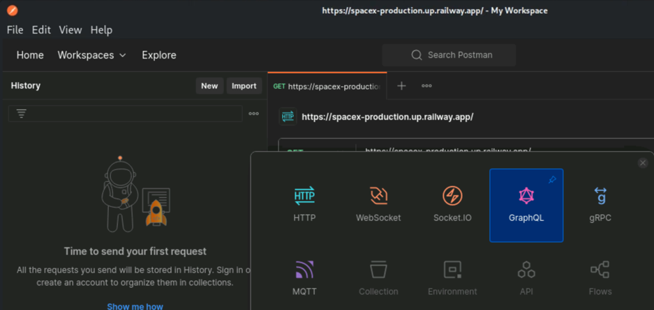

6. As URL, enter `https://spacex-production.up.railway.app/`. Postman will automatically detect that this is a GraphQL API and populate the Queries.  

    **Click below the url to open the list of queries**
    
    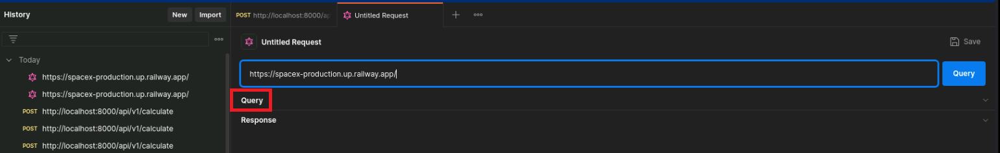
    
    **It should look something like:**
    
    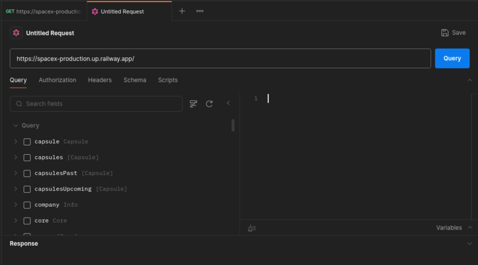

7. Spend a moment exploring the Queries.

8. In the query editor on the right, start by writing a simple query to fetch the name and date of the next SpaceX launch. Enter the following query:

    ```graphql
    {
      launchNext {
        mission_name
        launch_date_utc
      }
    }
    ```

9. Click on the **Blue Query** button to the right of the URL.   You may need to click on the up "**^**" symbol to on the Response line in order to view the output.

    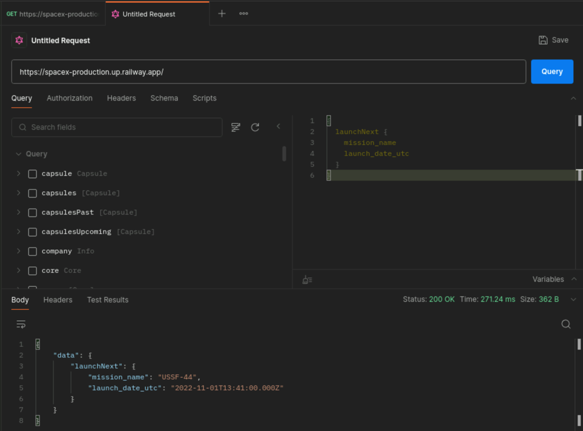

10. Let's continue by getting more data and details by including the rocket and the launch site. Enter the following query:

    ```graphql
    {
      launchNext {
        id
        mission_id
        mission_name
        launch_date_utc
        rocket {
          rocket_name
        }
        launch_site {
          site_name_long
        }
      }
    }
    ```

11. Click on **Query** and review the output.

    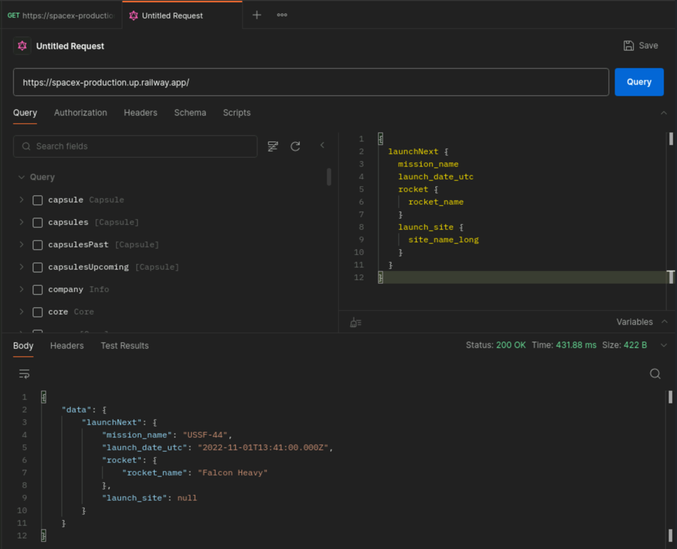

12. GraphQL queries all the usage of Arguments/Variables within Queries. Update the previous query by adding an Argument. Enter the following query:

    ```graphql
    {
      launch(id: "6243aec2af52800c6e91925d") {
        mission_name
        launch_date_utc
        details
        rocket {
          rocket_name
        }
        launch_site {
          site_name_long
        }
      }
    }
    ```
    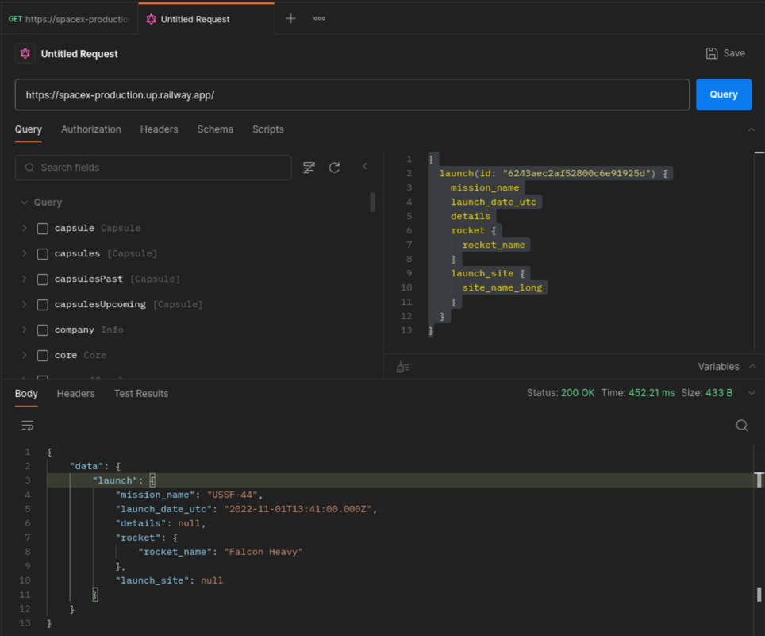

13. Click on **Query** and review the output.

14. Let's advance our GraphQL skills and adjust the queries using variables. Enter the following query:

    ```graphql
    query LaunchDetails($id: ID!) {
      launch(id: $id) {
        mission_name
        launch_date_utc
        details
        rocket {
          rocket_name
        }
        launch_site {
          site_name_long
        }
      }
    }
    ```

15. Click on **Variables** and enter the following JSON:

    ```json
    {
      "id": "6243aec2af52800c6e91925d"
    }
    ```
    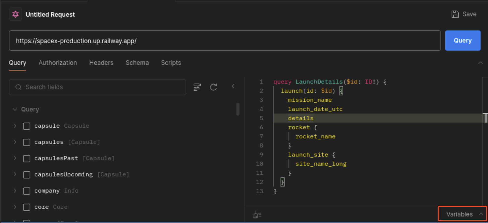
    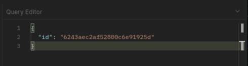

16. Click on **Query** and review the output.

17. To get some more practice, try to write your own queries and explore the SpaceX API.
    - List the last 5 launches with their mission names and launch dates.

        {}
    
```grapql
{
  launchesPast(limit: 5) {
    mission_name
    launch_date_utc
  }
}
```
        {}

    - Retrieve details of a specific rocket by its ID, including its name, type, and stages.
    
        {}

To get a list of all rockets, you can use the following query:
```grapql
{
  rockets {
    name
    type
    stages
  }
}
```

To solve the task, the following query using an ID can be used:
```grapql
{
  rocket(id: "5e9d0d95eda69973a809d1ec") {
    name
    type
    stages
  }
}
```
        {}

    - Get the upcoming launches with their mission names and launch dates.

        {}

 ```grapql
 {
   launchesUpcoming(limit: 5) {
     mission_name
     launch_date_utc
   }
 }
 ```
    
        {}

## Interacting with SOAP API
### SOAP API descriptor
1. Open Firefox Browser from the navigation bar

2. Open the following URL: ```https://www.crcind.com/csp/samples/SOAP.Demo.cls?wsdl```
   
    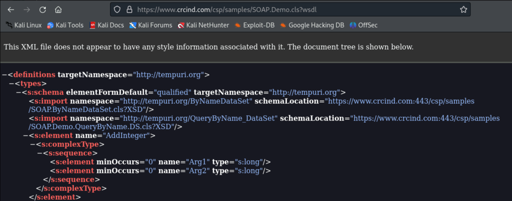

3. You will see the WSDL document, which describes the methods available in the SOAP API and their parameters.

### Interacting with SOAP API using Postman
1. Open the Postman application. If Postman is still open from the previous task, you can skip step 1-4

2. A new window will open which will look like this:

    

3. select **lightweight API client** below the Account creation form.

    

4. An empty Workspace will open.

5. Create a new HTTP request by clicking on **New** at the left top and the select **HTTP**

    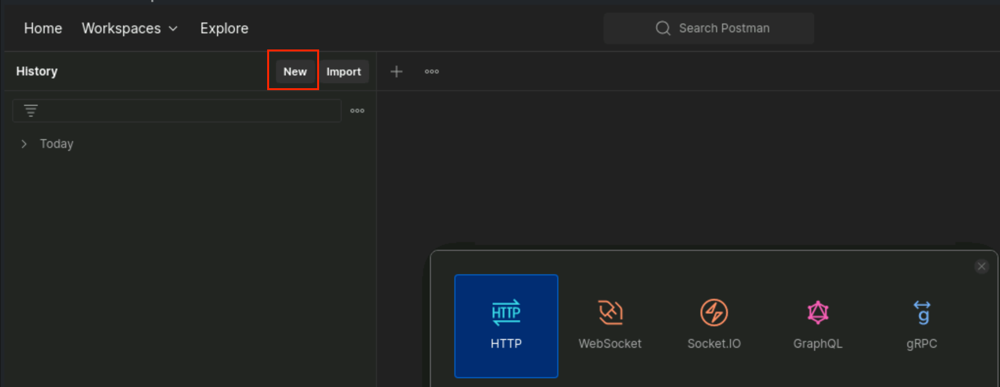

6. Change the request type to **POST** and enter the URL `https://www.crcind.com/csp/samples/SOAP.Demo.cls`

    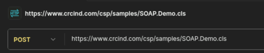

7. Click on the "Headers" tab. Add 2 new headers with the following key/value pairs:

    Key | Value
    --- | ---
    `Content-Type` | `text/xml`
    `SOAPAction` | `http://tempuri.org/SOAP.Demo.GetByName`
    
    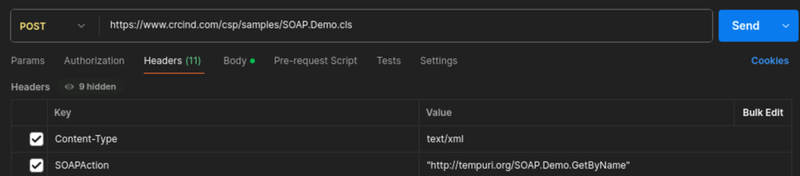

9. Click on the "Body" tab. Select the **raw** option and enter the following XML:

    ```xml
    <soapenv:Envelope xmlns:soapenv="http://schemas.xmlsoap.org/soap/envelope/" xmlns:tem="http://tempuri.org">
       <soapenv:Header/>
       <soapenv:Body>
          <tem:GetByName>
             <!--Optional:-->
             <tem:name>Solomon,Thelma J.</tem:name>
          </tem:GetByName>
       </soapenv:Body>
    </soapenv:Envelope>
    ```
    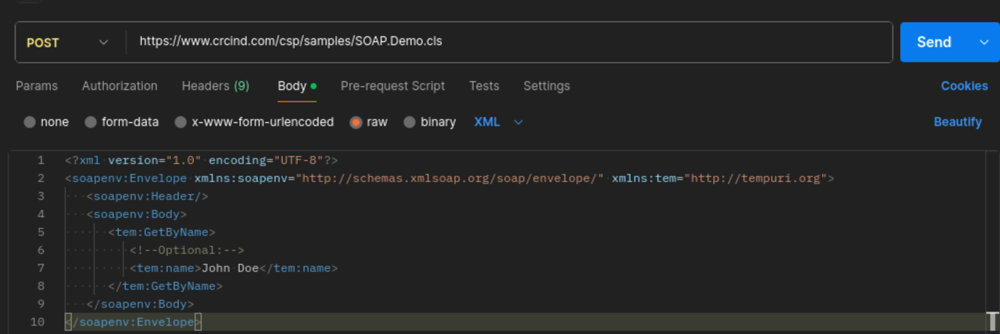

10. Click on **Send** and review the output. (Scroll down to find the details)
    - The **GetByNameResponse** contains the result of the **GetByName** method call. 
    - The **GetByNameResult** contains the details of the person with the name **Solomon,Thelma J.**

        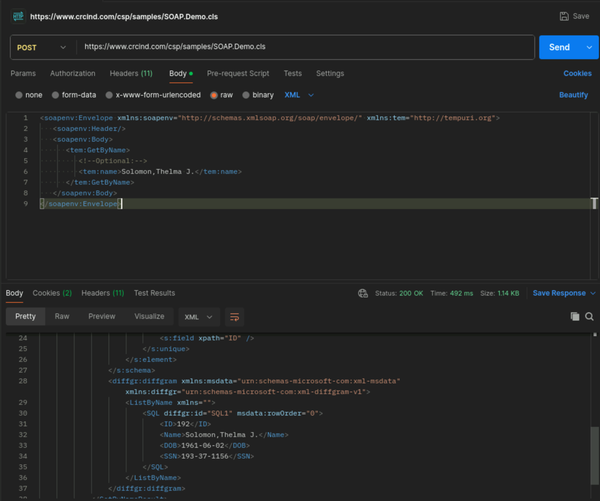

11. The WSDL document describes other methods that you can experiment with. For example, you can try the **AddInteger** method.

    {}
Update the header **SOAPAction** according to the function you want to use.

    {}

    ```xml
    <soapenv:Envelope xmlns:soapenv="http://schemas.xmlsoap.org/soap/envelope/" xmlns:tem="http://tempuri.org">
       <soapenv:Header/>
       <soapenv:Body>
          <tem:AddInteger>
             <tem:Arg1>5</tem:Arg1>
             <tem:Arg2>10</tem:Arg2>
          </tem:AddInteger>
       </soapenv:Body>
    </soapenv:Envelope>
    ```
    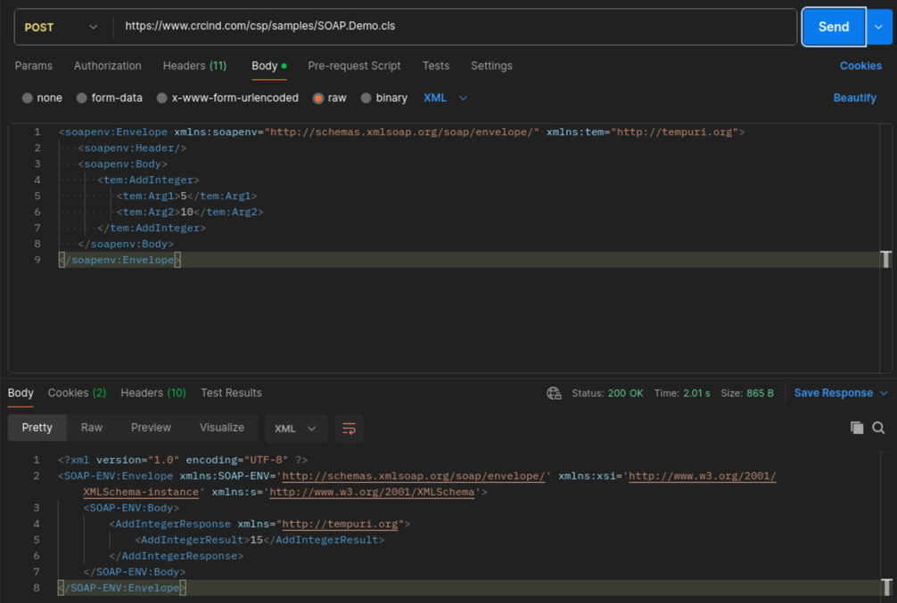