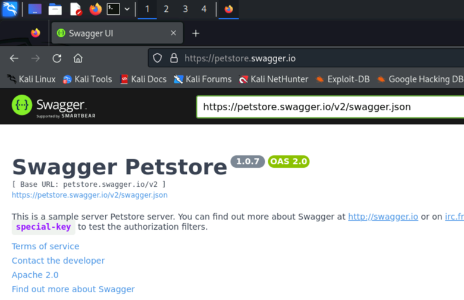
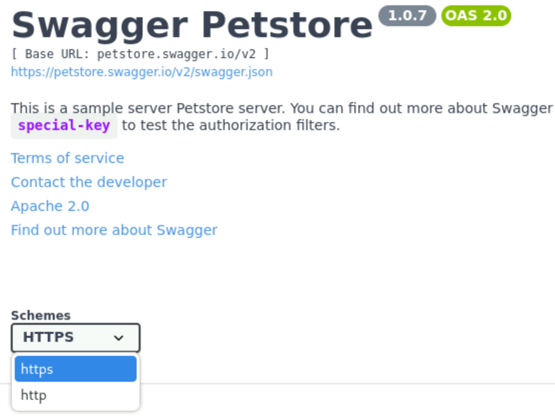
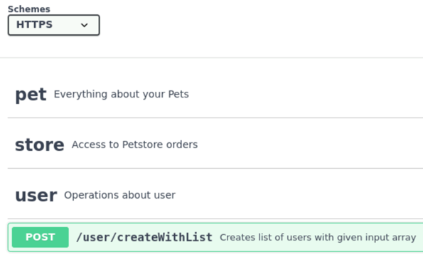
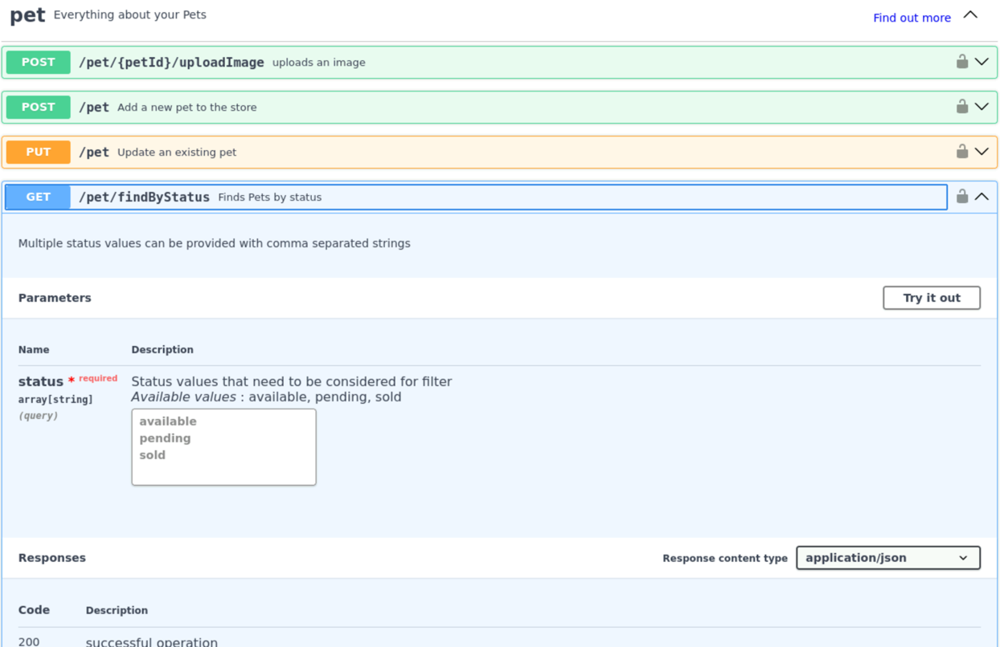
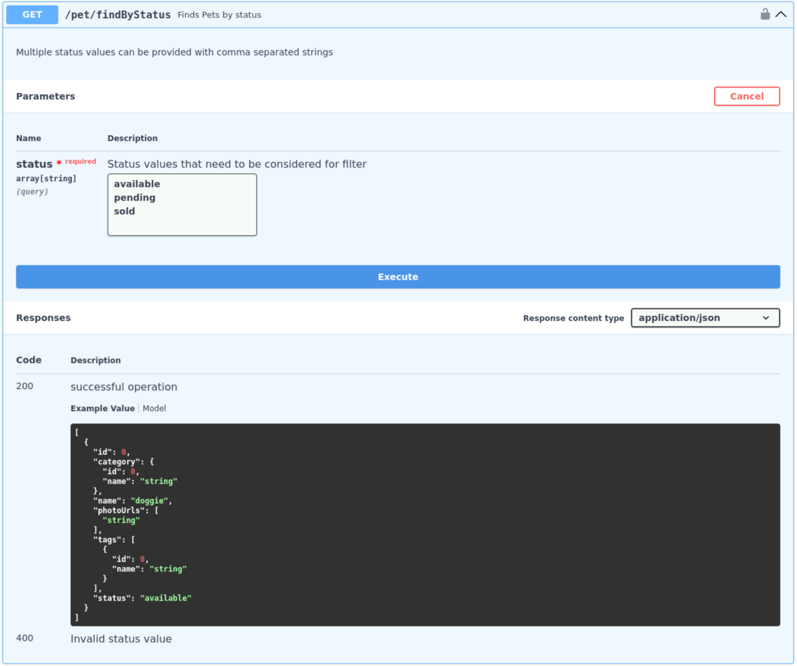
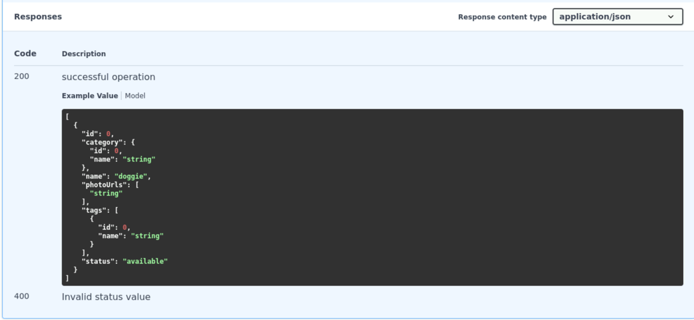
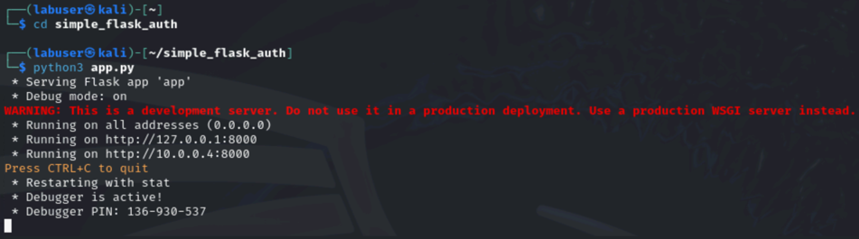
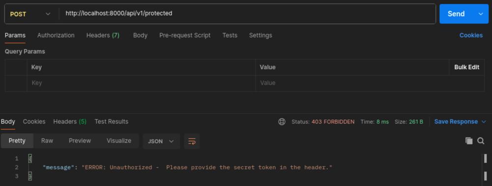
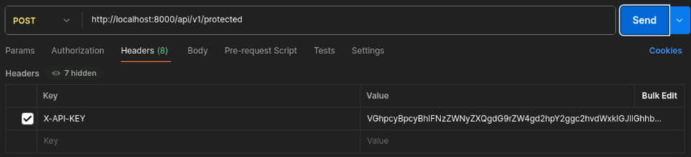
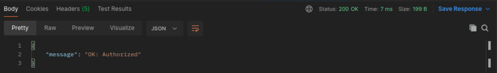

In this lab you will explore more advanced API handling techniques. This will based upon the previous labs and will require you to use the tools you have learned about.
We will cover topics like OAuth and JWT tokens, API security, and API testing.

## Documentation of APIs (aka Swagger UI)
1. Open the Firefox Browser and navigate to the following URL: `https://petstore.swagger.io/`

2. Familiarize yourself with the Swagger UI layout. The interface is divided into several sections: the header, the API information, and the list of endpoints.
3. At the top, you will see general information about the API including the title, version, description, and terms of service. Note the available schemes (HTTP or HTTPS) and the host (petstore.swagger.io).

4. Scroll down to see a list of available endpoints categorized by functionality (e.g., `pet`, `store`, `user`). Each endpoint shows the HTTP method (GET, POST, PUT, DELETE), the path, and a brief description of what the endpoint does.

5. Click on an endpoint to see more details about it. For example, click on the `GET /pet/findByStatus` endpoint.

6. You will see a description of the endpoint, the parameters it accepts, and the responses it returns. You can also try out the endpoint by clicking on the `Try it out` button.

7. After executing the call, review the response directly in the Swagger UI. The response section will show the URL, the request parameters, the server response including the status code, response body, and headers.

8. Spend some time exploring the different endpoints and trying them out. Try different HTTP methods (GET, POST, PUT, DELETE) and explore how the API handles each request.


## Interacting with protected APIs (API Token)
### Prepare the Flask application
1. change into folder from Task1 where you have cloned the Flask application to and start it
```bash
cd simple_flask_auth
python3 app.py 
```
2. You should see that the flask application has successfully started and is listening on port 8000.


### Interacting with protected APIs using Postman
1. Open the Postman application by typing the following command in a terminal window. If Postman is still open from the pervious task, you can skip step 1-4
```bash
Postman
```
2. A new window will open which will look like this:


3. select `lightweight API client` below the Account creation form.


4. A empty Workspace will open.
5. Create a new HTTP request by clicking on `+` at the top bar and enter the URL `http://localhost:8000/api/v1/protected`
6. Change the request type to `POST` and then click `Send`

7. You will receive a `403 Fortbidden` response. This is because the API requires a token to access it.
8. To keep it simple, only a specific header with a token need to be present in the request. This can be identified in the Flask application code.
```python
@app.route('/api/v1/protected', methods=['POST'])
def protected():
    if 'X-API-KEY' in request.headers and request.headers['X-API-KEY'] != 'VGhpcyBpcyBhIFNzZWNyZXQgdG9rZW4gd2hpY2ggc2hvdWxkIGJlIGhhbmRsZWQgdmVyeSBjYXJlZnVsbHkh':
        return jsonify({"message": "ERROR: Unauthorized - This is a protected resource. Specify the secret token in the header to access it."}), 403
    elif request.headers.get('X-API-KEY') != 'VGhpcyBpcyBhIFNzZWNyZXQgdG9rZW4gd2hpY2ggc2hvdWxkIGJlIGhhbmRsZWQgdmVyeSBjYXJlZnVsbHkh':
        return jsonify({"message": "ERROR: Unauthorized -  Please provide the secret token in the header."}), 403
    elif request.headers['X-API-KEY'] == 'VGhpcyBpcyBhIFNzZWNyZXQgdG9rZW4gd2hpY2ggc2hvdWxkIGJlIGhhbmRsZWQgdmVyeSBjYXJlZnVsbHkh':
        return jsonify({"message": "OK: Authorized"}), 200
```
9. Configure the HTTP header `X-API-KEY` with the correct value identified in the Flask Python code.

10. You can now try to access the protected endpoint with the correct token. You should receive a `200 OK` response.

