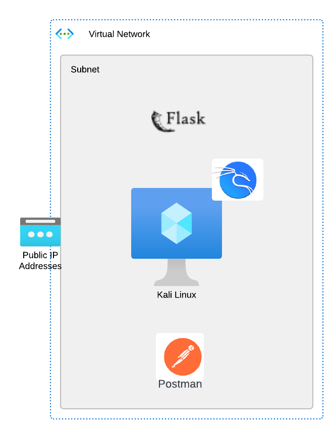

This Module covers APIs starting with basics and then moving on to more advanced topics.  As with the first module.  All applications used for this module will be contained on the **Kali** linux device.

### Topics:
- interact with various types of APIs using CURL and Postman
- how to authentication is handled
- how to document APIs
