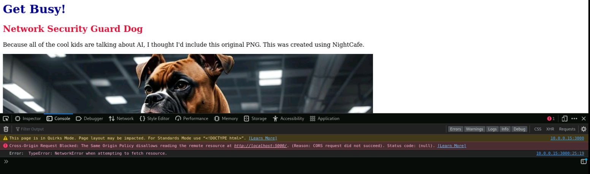

We hav
## Browse the App
- From the Kali Desktop, open Firefox
- Let's call the front end service.  In the url bar, type ```http://10.0.0.15:3000```.  You should see some text and a picture
- Now Let's call the back end service.  In the url bar, type ```http://10.0.0.15:5000```.  You should see a "todo" list.

## Is it working properly?

At first glance, everything seems to be operating properly.  We can see both the front end and the back end services.  The back end is serving data from the Database service.  Let's take a closer look at the developer tools and determine if anything is missing.

- Open Firefox from Kali, and "right click" on the window.  Select **Inspect (Q)
- Now browse to the front end service ```http://10.0.0.15:3000```
- Click on the **Network** tab.  Notice that there is a GET that seems to have failed to **http://localhost:5000**




## Let's fix it

We've determined that there is some content which is not being served properly to the front end.  We know that the data is there from our first excercise above.  Since we found the issue by interacting with the front end, let's go check that first.

- SSH to the Ubuntu server ```ssh labuser@10.0.0.15``` enter password ```S3cur3P4ssw0rd123!```
- Navigate to the front end folder, type ```cd docker-compose-101/frontend```
- Now let's look at the index.html page and see if we can find any reference to **http://localhost:5000** by typing ```nano index.html``` 
- Use your arrow keys to navigate the cursor until you find it
- I you would like a hint, see below

<details>
  <summary><h5><b>Click here for hint</b></h5></summary>
   
   

</details>

- This bit of "script" code is telling the web client to fetch the data at **http://localhost:5000**.  If we remember from our first exercise, port 5000 was returning data.  Why isn't this working?

<details>
  <summary><h5><b>Click here for answer</b></h5></summary>
   
   **If our client were on the same local machine as our application, this would work fine.  Since our client is a different host, when it recievces the script to fetch data from http://localhost:5000 it queries itself, and of course doesn't find anything.**

</details>

- Ok, so how can we fix it?  See if you can figure it out before checking the answer!

<details>
  <summary><h5><b>Click here for answer</b></h5></summary>
   
   **In this case, we need to change the script to reference a valid url, which is reachable by our client (or any external client).**  
   
   - We could change the url to read ```http://10.0.0.15:5000```.  This would work fine as long as our clients are on the same network as the service.
   - In a production environment, more than likely our clients will be on different networks than our services.  We may also want to distribute the services regionally or even globally.  This is where we would use a domain name.  In our case, we may want to use something like```http://appexample:5000```.

</details>

- Us Nano to fix the code.
    - Navigate up/down and left/right with the arrow keys
    - Delete text using the backspace or delete keys
    - Type text as normal with the keyboard
    - When done
        - Type ctrl + o
        - Hit enter
        - Type ctrl + x 

<details>
  <summary><h5><b>Click here for example</b></h5></summary>
   
   Depending on the method you decided on to fix the code, use Nano to update the Hosts file on Kali
    - From the **Kali** terminal ```sudo nano /etc/hosts```
    - Navigate to the bottom and input a host entry ```10.0.0.15    appexample```
   
   

</details>


- Now we should be able to navigate to the page and see that our todo list from the Database has been rendered.

## SUCCESS!!!


