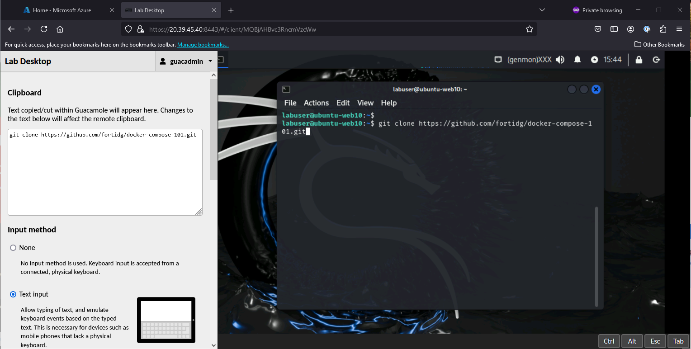
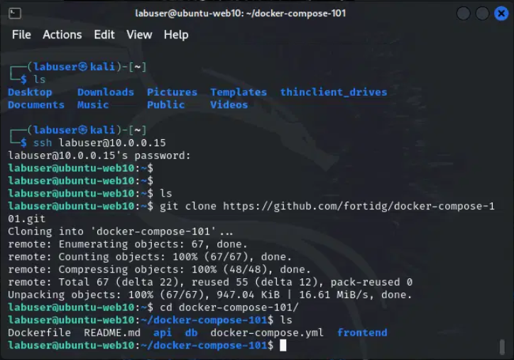
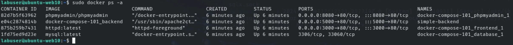

|                            |    |  
|----------------------------| ----
| **Goal**                   | Install application
| **Task**                   | We will clone a simple, 3 tiered web application and use docker-compose to deploy it
| **Verify task completion** | If properly executed, you should see that four containers are running

For the purpose of this lab, we are going to use an application adapted from the excellent training found at [this link](https://medium.com/@kesaralive/getting-started-with-docker-compose-hands-on-project-experience-e562ab07e24c).  If you would like to dig deeper into how to create a 3 tiered application using Docker, go check it out.  We will be using Docker-Compose to bring up a pre-configured Application.

{}
**According to IBM:**
Docker is an open-source platform that enables developers to build, deploy, run, update and manage containers.

Containers are standardized, executable components that combine application source code with the operating system (OS) libraries and dependencies required to run that code in any environment.

Containers simplify the development and delivery of distributed applications. They have become increasingly popular as organizations shift to cloud-native development and hybrid multicloud environments.  For more information check out [this link](https://www.ibm.com/topics/docker).
{}

{} If you need help accessing Kali, refer back to  **Module 1: HTTP Fundamentals**. The IP Address of the Kali server can be found by opening the Azure shell and typing ```cd api-and-websvc-fundamentals/terraform``` and then typing ```terraform output```. Also, the terraform output command will have the public IP of the Ubuntu host, just in case you would like to log in from an ssh app or terminal on your laptop.{}

## Connect to Ubuntu
- From a Kali terminal, ssh to the Ubuntu host by typing ```ssh labuser@10.0.0.15``` when prompted for the password enter ```S3cur3P4ssw0rd123!```

## Get the Repo
- Open the Kali clipboard by typing ctrl+shift+alt and selecting Text input
- Paste in ```git clone https://github.com/fortidg/docker-compose-101.git``` 
- Right Click and select **Paste Clipboard** to put the text into the Kali terminal



- You may have to type ctrl+shift+alt again to close the clipboard.
- Hit enter to clone the repo
- Go to the docker-compose-101 folder by typing ```cd docker-compose-101```





## Start the Application

- At the prompt, type ```sudo docker-compose up```.
- The application will take a few minutes to come up and download all of the required packages.  Once it is complete you should see something along the below lines, indicating that the sql server is ready.  

```
database_1    | 2024-07-09T16:10:24.495277Z 0 [System] [MY-010931] [Server] /usr/sbin/mysqld: ready for connections. Version: '9.0.0'  socket: '/var/run/mysqld/mysqld.sock'  port: 3306  MySQL Community Server - GPL.

```

- Open a second terminal ```ssh labuser@10.0.0.15``` enter password ```S3cur3P4ssw0rd123!```
- Let's see what containers are running, by issuing the ```sudo docker ps -a``` command.
- You will see a number of apps open.
- Take note of the port numbers for the apps




