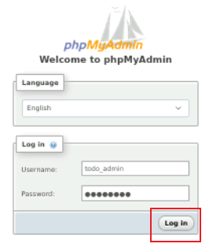
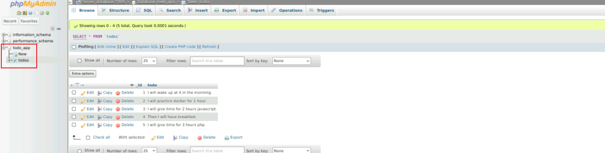
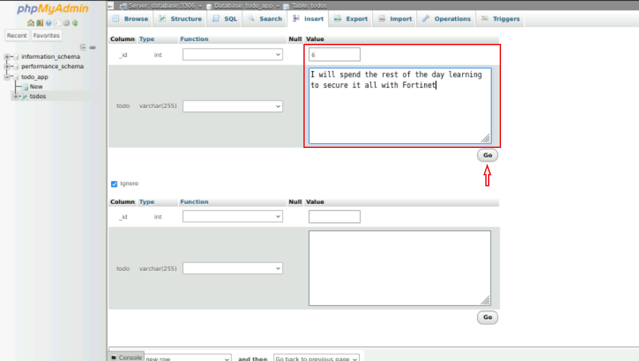
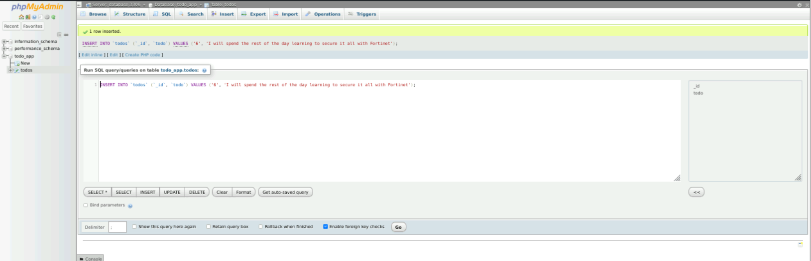
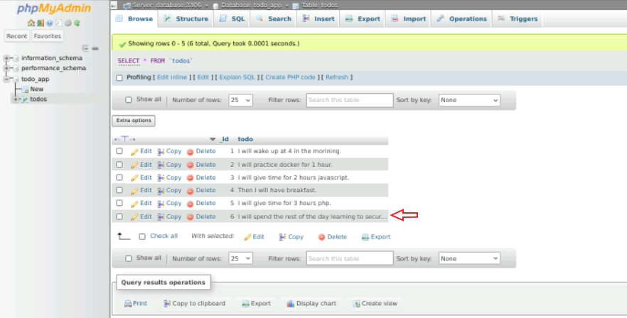
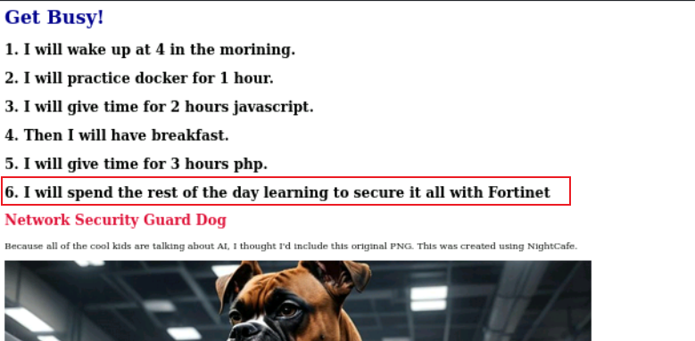

|                            |    |  
|----------------------------| ----
| **Goal**                   | Gain a better understanding of the Database Tier
| **Task**                   | Use phpMyAdmin application to manage the database
| **Verify task completion** | If completed properly, you should see changes made to the database reflected on the rendered web page.

Now that we have explored the interaction between the Front End and Back End services, lets' take a look at the Database portion of the Application.  When the browser requests content from http://appexample:5000, a series of PHP scripts generate a SQL query which is sent to the Database service.  The returned data is formatted into JSON and sent to the browser for inclusion in the page content.

{}
The term PHP is an acronym for – Hypertext Preprocessor. PHP is a server-side scripting language designed specifically for web development. It is open-source which means it is free to download and use. It is very simple to learn and use. The file extension of PHP is “.php”.  
If you would like to know more about PHP, [W3 schools](https://www.w3schools.com/php/default.asp) has a great tutorial.
{}

## Login to phpMyAdmin
This is a free tool written in PHP intended to provide a web GUI for the administration of MySQL Databases.
- From the Kali Desktop, open Firefox and navigate to ```http://appexample:8080```
- You will be presented with a login screen.  Enter ```todo_admin``` as the Username and enter ```password``` as the Password.  Click login.




## Update the Database

Now that we are logged in, let's add some new data

- From the left side menu, click on the **+** sign next to **todo_app**
- Next click on **todos**.  You should see the Database we are using for our app in the main window.



- Now let's add a new data point.  Click on the tab labeled **Insert**
- For **_id** add a value of ```6```
- For **todo** add a value of ```I will spend the rest of the day learning to secure it all with Fortinet```
- Leave all other values as default and click **Go**



- You should see a screen like below indicating that you have successfully inserted a new row



- Now click on the Browse tab.  You should see your new line at the bottom.



- Finally, in a Firefox browser on Kali, navigate to ```http://appexample:3000```.  You should see the new data populated.



