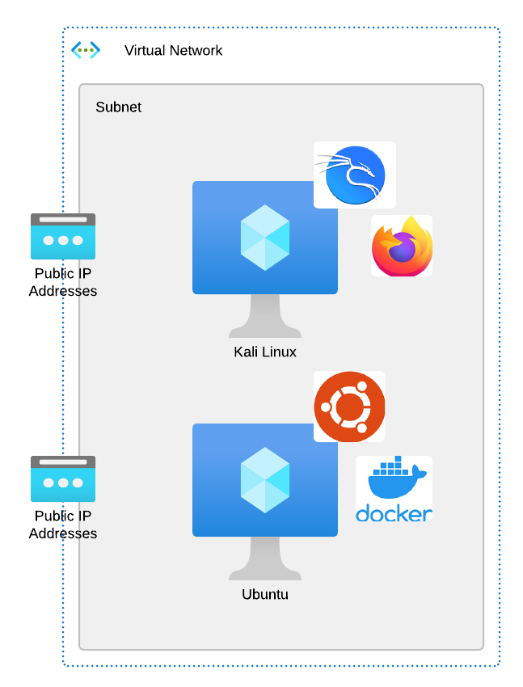
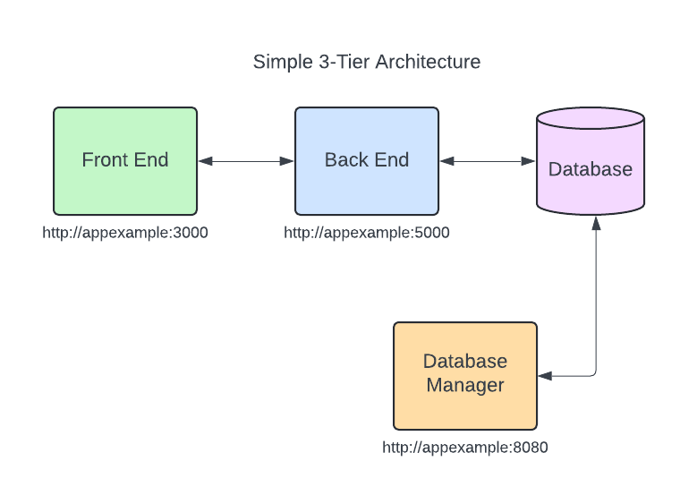

In this section, we have discussed the benefits of using modern tiered applications.  The below diagram highlights the architecture of a very simple Docker application which will be deployed on our **Ubuntu** host using Docker-Compose.  We will interact with this application from the **Kali** host.  Our goal is to better understand this architecture and how these different tiers interact with one another.

